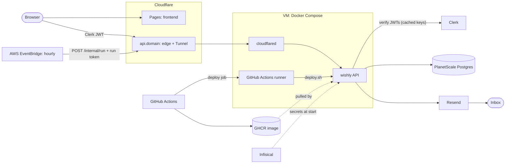

# Wishly infrastructure

How Wishly runs in production, why each piece is there, and how it all gets
built. The step-by-step commands live in the [README](../README.md); this doc
explains what those steps create and how the parts depend on each other.

## The system

| Piece | What it does | Where it's defined |
|---|---|---|
| **VM** | Runs the API and cloudflared in Docker Compose, plus the GitHub Actions runner. Any Ubuntu/Debian box on Tailscale. | `infra/ansible`, `infra/compose.yaml` |
| **API image** | The FastAPI app, one image on GHCR, tagged by commit SHA and `latest`. | `backend/Dockerfile`, `.github/workflows/api.yml` |
| **PlanetScale Postgres** | The only stateful piece. Postgres 18, two roles. | `infra/terraform/database.tf`, `infra/sql/schema.sql` |
| **Cloudflare Tunnel + DNS** | Public HTTPS for `api.<domain>` with no open ports or public IP on the VM. | `infra/terraform/tunnel.tf` |
| **EventBridge** | Calls `POST /internal/run` at minute 0 of every hour. The app has no scheduler of its own. | `infra/terraform/schedule.tf` |
| **Infisical** | The one place secrets live. The VM reads them at container start. | Set up by hand |
| **Terraform state** | S3 bucket, versioned, S3-native locking. | Created by hand (see README step 2) |
| **Clerk, Resend** | Sign-in and email. SaaS, configured in their dashboards. | — |

## Three paths through the system

**A user request.** Browser → `api.<domain>` (Cloudflare) → Tunnel → cloudflared
on the VM → the API on `localhost:8000`. cloudflared shares the API container's
network namespace, the same way two containers in one ECS task would, so the
tunnel's route is `localhost:8000` wherever it runs. The API checks the Clerk
JWT's signature against Clerk's public keys (cached, so no per-request call),
then queries PlanetScale as `wishly_app`.

**The hourly run.** EventBridge → the same public hostname, with
`Authorization: Bearer <run token>`. For each reminder whose send time falls in
this hour or the last, the API inserts a row into `sends` (the primary key lets
exactly one run win), then emails it through Resend. A failed send deletes its
row, so the next run retries it. EventBridge retries for up to 10 minutes;
duplicates can't happen because of the `sends` key.

**A deploy.** Merge to `main` → GitHub-hosted runner runs the tests and pushes
`ghcr.io/<owner>/wishly:<sha>` and `:latest` → the self-hosted runner on the VM
runs `/opt/wishly/deploy.sh`, which:

1. logs in to Infisical with the VM's read-only machine identity,
2. `infisical run -- docker compose pull`,
3. `infisical run -- docker compose up -d --wait`, which fails the job if the
   new container doesn't pass its `/healthz` check.

## Secrets: where each one comes from and goes

Every secret is created in one place, stored in Infisical, and read only by
what needs it. Nothing secret is committed, baked into the image, or written to
a config file on the VM.

| Secret | Created by | Read by |
|---|---|---|
| `WISHLY_DATABASE_URL` (`wishly_app` role) | Terraform (`terraform output -json infisical_values`) | The API |
| `WISHLY_SCHEMA_DATABASE_URL` (`wishly_schema` role) | Terraform | You, when applying `schema.sql` |
| `WISHLY_RUN_TOKEN` | Terraform (`random_password`) | The API; EventBridge holds its own copy |
| `TUNNEL_TOKEN` | Terraform (Cloudflare) | cloudflared |
| `WISHLY_RESEND_API_KEY` | Resend dashboard | The API |
| `WISHLY_CLERK_ISSUER`, `WISHLY_CORS_ORIGINS`, `WISHLY_IMAGE` | Terraform (plain config, not secret) | The API / Compose |
| Infisical machine identity | Infisical, by hand | `deploy.sh` on the VM (`/opt/wishly/infisical.env`, mode 0600) |
| Provider tokens (AWS, Cloudflare, PlanetScale) | Each dashboard | Terraform, from your shell's environment |

**Secret zero.** Something has to unlock Infisical. On the VM that's a
read-only machine identity in a file only the deploy user can read. It is
scoped to one project, can't write, and is replaced by re-running Ansible.

**Terraform state holds secrets.** The database passwords and run token sit in
state, because Terraform generated them and has to output them. That's why the
state bucket is private, versioned, and blocks all public access.

## Least privilege

- **Database roles.** The API connects as `wishly_app`
  (`pg_read_all_data` + `pg_write_all_data`): it can read and write rows but
  cannot create, alter, or drop tables. Only `wishly_schema` (inherits
  `postgres`) can change the schema, and only a person uses it.
- **EventBridge's IAM role** may call exactly one API destination, nothing else.
- **The run token** only opens `/internal/run`. User endpoints need a Clerk JWT.
- **The VM** has no inbound ports. The tunnel dials out to Cloudflare, and you
  reach the box over Tailscale.

## The self-hosted runner on a public repo

The runner can run any workflow job that asks for `runs-on: [self-hosted,
wishly-vm]`, and it runs as a user in the `docker` group, which is effectively
root on the VM. On a public repo, a pull request from a fork could edit a
workflow to target it. Two guards:

1. The deploy job only runs for pushes to `main`, which only you can make.
2. Repo setting **Actions → General → fork pull request workflows → Require
   approval for all external contributors**, so a stranger's workflow never
   runs until you've read it.

## Build order, and why

Each step needs something the one before it made:

1. **Image** (CI on push): the VM needs something to pull.
2. **State bucket** (by hand): Terraform can't store state in a bucket it hasn't
   made yet.
3. **Infisical project + VM identity** (by hand).
4. **Terraform apply**: database, roles, tunnel, DNS, schedule. Copy its
   outputs into Infisical.
5. **Schema** (`psql` with `wishly_schema`): tables must exist before the API
   serves traffic.
6. **Ansible**: Docker, Infisical CLI, runner, `compose.yaml`, `deploy.sh`.
7. **First deploy** (`deploy.sh` by hand). From then on, merges deploy.
8. **Frontend** on Cloudflare Pages, pointed at `https://api.<domain>/v1`.

EventBridge starts calling `/internal/run` as soon as step 4 finishes. Until
step 7 those calls fail and EventBridge gives up after 10 minutes; nothing
breaks.

## When something fails

| Failure | What happens | What users see |
|---|---|---|
| PlanetScale down | `/healthz` stays 200 (process is fine); `/readyz` returns 503; API calls fail | Errors until it's back. Hourly sends inside the window retry on the next run. |
| VM down | Cloudflare can't reach the tunnel | Site is down. Reminders more than an hour late are dropped. |
| Resend down | The send fails, its `sends` row is deleted | Retried next hour if still within the one-hour window. |
| EventBridge fires twice | Both runs try to claim each reminder | One email; the second insert finds the row and skips. |
| A deploy ships a broken image | `up --wait` fails its healthcheck | The deploy job fails in GitHub. Roll back by deploying the previous `:<sha>`. |
| Terraform state lost | — | Prevented: state is in versioned S3, never on a laptop. |

## Known gaps

- **No failover.** If the VM is down, so is Wishly. The planned fix is a
  zero-count ECS Fargate service plus a watchdog that scales it up when
  `/healthz` stops answering.
- **No alerting.** Nothing tells you when a run fails or the VM goes down.
- **Clerk deletions don't propagate.** A user deleted in Clerk's dashboard keeps
  their rows until removed by hand (fix: a `user.deleted` webhook).
- **Deploys track `:latest`.** Rolling back means setting `WISHLY_IMAGE` to an
  older `:<sha>` in Infisical and running `deploy.sh`.
- **EventBridge's 5-second timeout** on `/internal/run`. Fine for a handful of
  users; at scale the endpoint would queue the work and return immediately.

## History: v1's lost Terraform state

v1's state file lived on a laptop and was deleted with its directory. Terraform
then knew nothing about ~20 live AWS resources, so `terraform destroy` would
have done nothing while a failover watchdog kept trying (and failing) to start
ECS tasks every 15 minutes. The orphans were found by their `Project=wishly`
tags and deleted with the AWS CLI in dependency order (consumers before what
they consume, the VPC last). v2 keeps state in a versioned S3 bucket from day
one.
